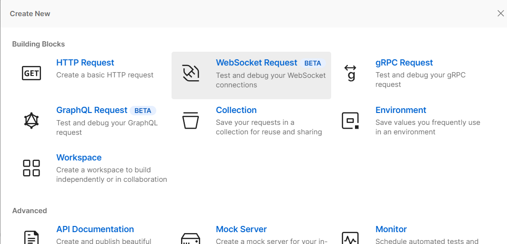
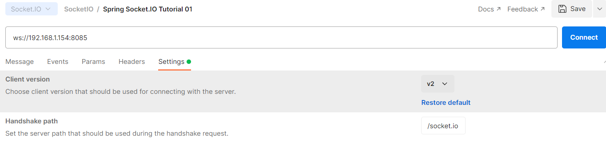
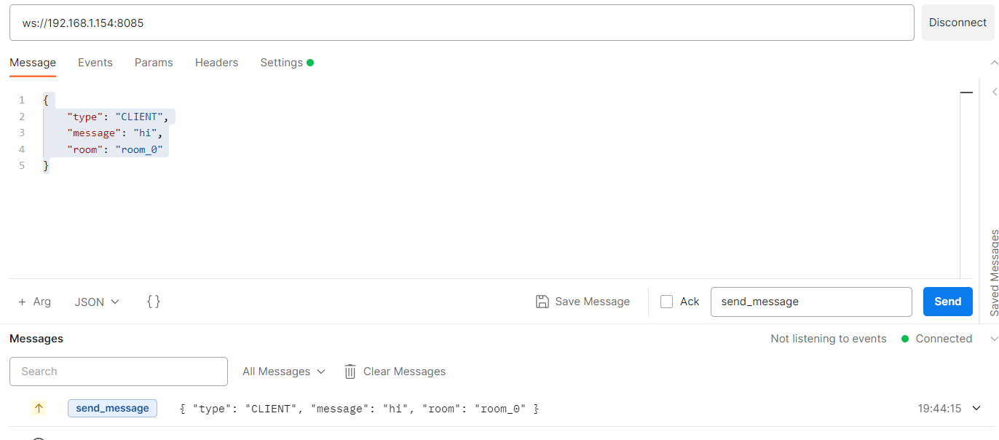
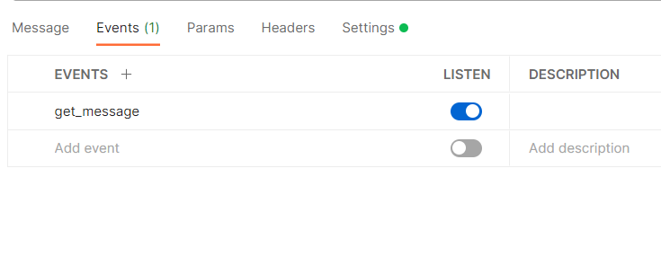

# art-spring-socketio
Testing project for study Socket IO

---
### Tutorial 01 - [Spring Boot Netty Socket.IO Example](https://medium.com/folksdev/spring-boot-netty-socket-io-example-3f21fcc1147d)

#### Testing through Postman 

- New &rarr; WebSocket Request 



- `ws://192.168.1.154:8085`
- Settings &rarr; Client Version: `v2` &rarr; Connect



- Message

```json
{
    "type": "CLIENT",
    "message": "hi",
    "room": "room_0"
}
```

- JSON
- Event name: `send_message` &rarr; Send


- Expected logs
```
2023-03-06T19:41:40.821+02:00  INFO 21184 --- [ntLoopGroup-3-5] n.s.study.nettysocketio.SocketModule     : Socket ID[2febb20d-81ec-4b4c-87bf-0854eb387c20]  Connected to socket
2023-03-06T19:44:15.862+02:00  INFO 21184 --- [ntLoopGroup-3-5] n.s.study.nettysocketio.SocketModule     : Message(type=CLIENT, message=hi, room=room_0)
```
- Add Event Listener:
  - Events &rarr; Add `get_message`


- Duplicate Tab and test with two clients 

